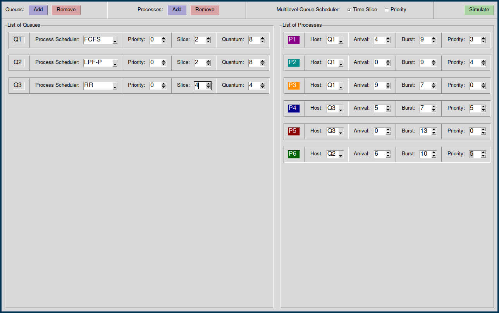

# QueueSim

QueueSim is a Python-based application designed to simulate various multilevel queue scheduling algorithms. It features a modular architecture and a user-friendly graphical user interface (GUI), making it an excellent tool for studying and analyzing process scheduling in operating systems.

<p align="center">
  
  
</p>

## Project Overview

QueueSim supports a wide range of scheduling algorithms and provides detailed simulation results. Its modular design allows for easy extension and customization.

### Key Features

- **Multilevel Queues**: Supports both time slice-based and priority-based multilevel queues.
- **Scheduling Algorithms**: Includes First-Come-First-Serve (FCFS), Shortest Remaining Time First (SRTF), Least Priority First (LPF), and Round Robin with custom quantum.
- **Scheduling Methods**: Allows simulation of both preemptive and non-preemptive scheduling.
- **Graphical User Interface (GUI)**: Provides an intuitive GUI for easy interaction and visualization.
- **Detailed Results**: Generates comprehensive results including maximum, minimum, and average waiting times, as well as the number of context switches.

## Installation

To install QueueSim, clone the repository and install the required dependencies:

```bash
git clone https://github.com/yourusername/QueueSim.git
cd QueueSim
```

## Usage

Run the main script to start the GUI and begin simulating:

```bash
python main.py
```

### Files Description

- `main.py`: Entry point for the application, initializes and runs the simulation.
- `main_gui.py`: Contains the code for the graphical user interface.
- `process_logic.py`: Handles the logic related to process management.
- `queue_logic.py`: Manages the queue structures and scheduling algorithms.
- `results_gui.py`: Manages the display of simulation results.


## Contributing

We welcome contributions! To contribute, please follow these steps:

1. Fork the repository.
2. Create a new branch (git checkout -b feature-branch).
3. Commit your changes (git commit -m 'Add new feature').
4. Push to the branch (git push origin feature-branch).
5. Create a new Pull Request.

## License

QueueSim is licensed under the GNU General Public License v3.0. 
See the  file for more information.

## Acknowledgements

We would like to thank everyone who contributed to the development of QueueSim. 
Your support and feedback are invaluable.

## Contact

For any questions or suggestions, please contact  or .
